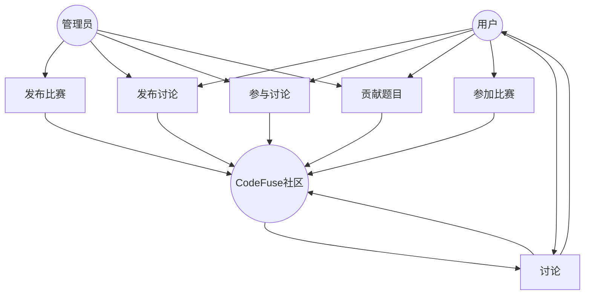
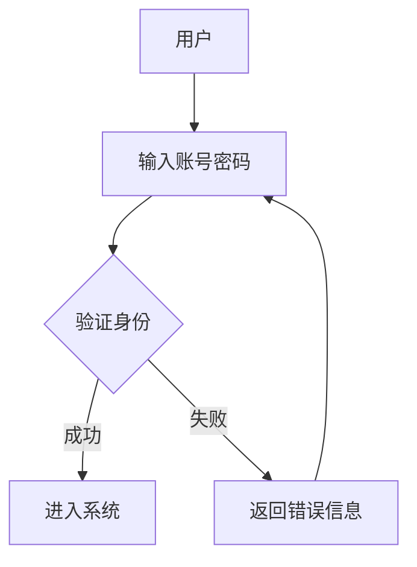
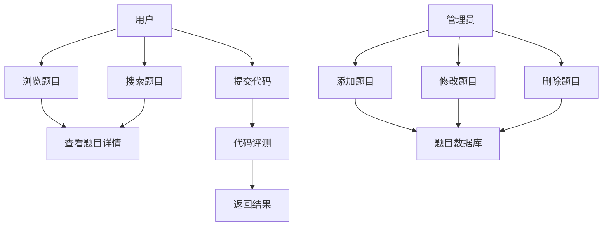
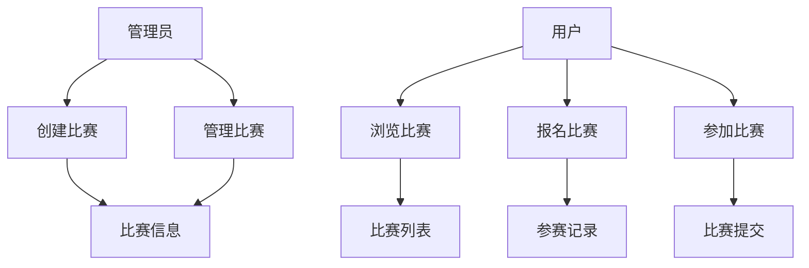
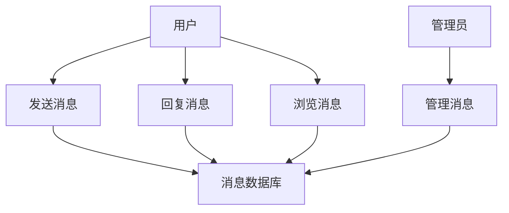
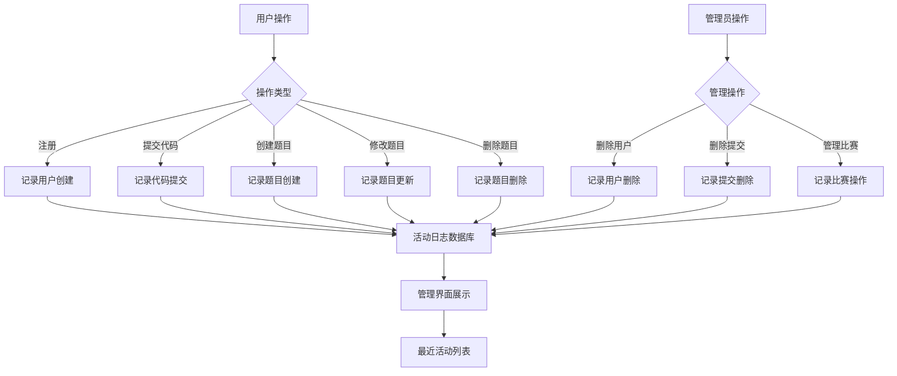
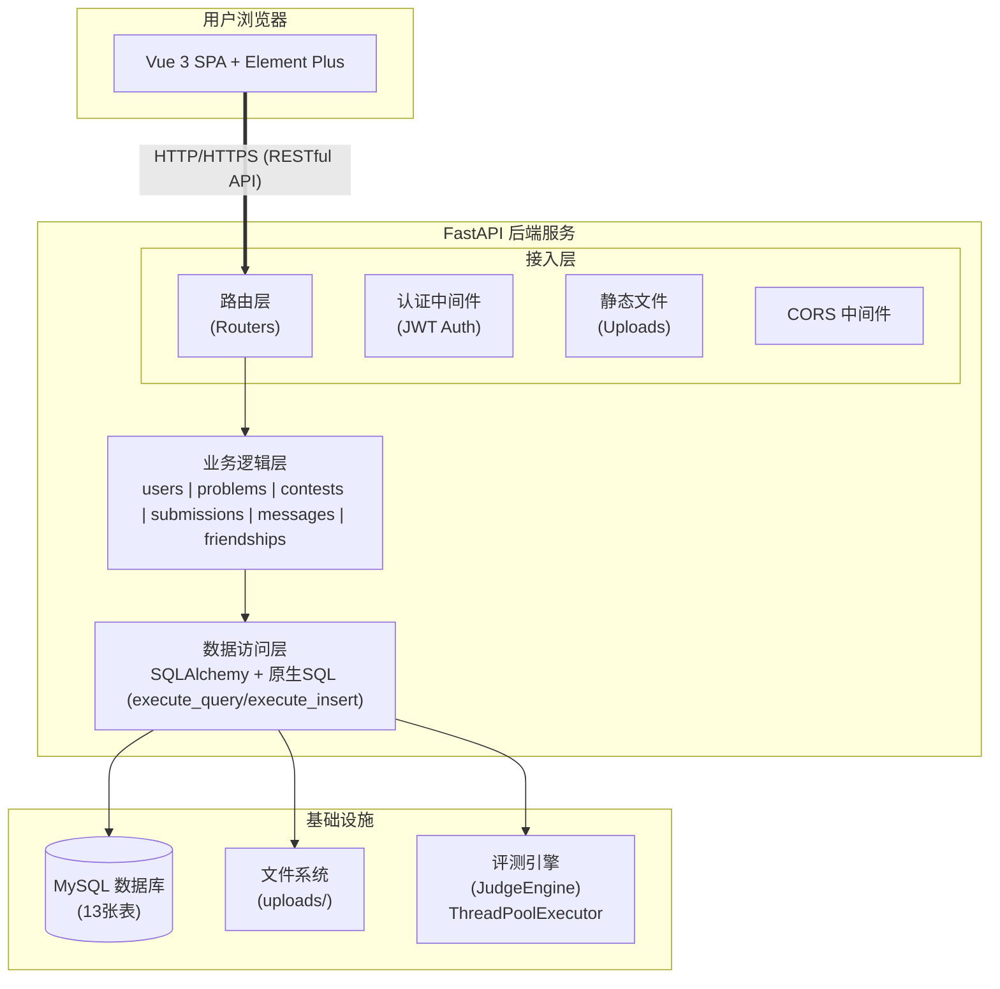
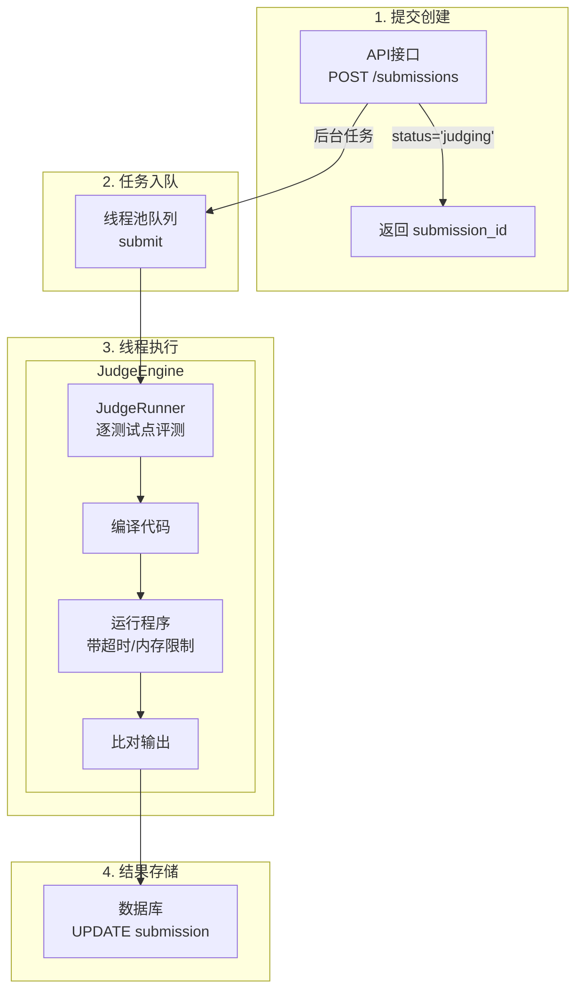

# CodeFuse —— 编程学习系统设计文档

[toc]

## 一、需求分析

### 1.1 需求描述

#### 1.1.1 背景调研

通过**积极调研信息类相关专业学生在编程学习过程中遇到的困境**，**了解未来职业素养需求**，我们发现传统的编程学习平台**单向答题 + 低效讨论**的模式存在一定弊端。

#### 1.1.2 用户调研

通过对信息类专业学生和互联网从业者的问卷调查，我们初步总结需求如下：

| 信息类专业本科生             | 信息类专业研究生               | 互联网从业者               |
| ---------------------------- | ------------------------------ | -------------------------- |
| 问题和讨论能及时得到反馈     | 能够得到面向就业机试的系统训练 | 团队协作开发能力           |
| 能有相对独立的思考和作答空间 | 问题和讨论能及时得到反馈       | 便捷，轻量，高效的学习工具 |

#### 1.1.3 需求总结

1. 系统，专业的训练资源的需求
2. 协作开发和即时讨论的需求
3. 轻量，便捷，容易上手的需求
4. 独立思考作答的需求
5. 其他

#### 1.1.4 项目优势

​	通过上述需求分析可见，当前主流编程学习平台**单向答题 + 低效协作**的模式已经很难满足未来强调团队协作的职业需求。同时，其**低效的反馈模式**也很难帮助初学者解决学习中遇到的困难。

​	我们的 CodeFuse（代码融合） 项目致力于解决上述问题，实现一个协同，开放，轻量化的编程学习系统，使得三类目标用户在多种场景和需求下获得利好：

* 多态学习：支持团队协作和独立尝试两种模式，用户可以选择尝试自己独立解决某问题，也可以选择团队协作解决某问题。
* 即时反馈：任一用户在解决某问题的时候可以向其他用户请教，也可以将自己的问题，或者对别人问题的回答发布在题目讨论区。
* 开放社区：任一用户可以向社区贡献题目，发布讨论，也可以向其他用户私信请教或者提供帮助。
* 模拟训练：任一用户可以参加社区的比赛，以模拟他们需要面对的各类比赛，考试，面试。


### 1.2 数据流图

**(1) 顶层数据流图**



**(2) 用户登录数据流图**



**(3) 题目管理数据流图**



**(4) 比赛管理数据流图**



**(5) 消息系统数据流图**



**说明**：消息系统支持两种类型：
- **题目讨论消息（topic）**：用户在题目下发表讨论，通过 message_problem 关联到题目
- **私信消息（private）**：用户之间的私信，通过 message_recipient 指定接收者

**(6) 活动日志数据流图**



**说明**：活动日志系统自动记录所有关键操作，包括：
- **用户操作**：注册、提交代码、创建/修改题目等
- **管理员操作**：删除用户、删除提交记录、管理比赛等
- **展示用途**：在管理界面的"系统统计"标签中展示最近活动时间线

### 1.3 数据元素表

共13个数据库表（6个实体表 + 7个联系表）

**重要说明**：
- **10种联系关系**：E-R图中包含10种实体间联系关系
- **7个联系表**：其中7种多对多关系需要独立的联系表实现，3种一对多关系通过外键直接实现
- **外键实现的联系**（不需要独立联系表）：
  - 管理题目：problem表的creator_id外键指向user表
  - 管理竞赛：contest表的creator_id外键指向user表
  - 用户活动日志：activity_log表的user_id外键指向user表
- **联系表实现的联系**（多对多关系）：
  - contest_problem（竞赛-题目）
  - contest_user（竞赛-用户）
  - message_problem（消息-题目）
  - message_recipient（消息-接收者）
  - problem_submission（题目-提交）
  - user_submission（用户-提交）
  - **friendship（好友关系）**：用户的自引用多对多关系，通过user_id和friend_id两个外键都指向user表

**其他说明**：
- 用户和管理员通过同一个 user 表存储，使用 role 字段区分角色
- **消息系统增强**：通过 message_type 字段区分题目讨论（topic）和私信（private）两种类型；**私信仅允许好友之间发送**，系统在创建私信时会验证发送者和接收者之间是否存在accepted状态的好友关系
- 提交记录与用户的关联通过 user_submission 联系表实现，支持协作提交场景
- **评测结果作为提交的属性**：judge_results 以 JSON 数组格式存储在 submission 表的 judge_results 字段中，每个测试点的详细运行结果作为数组元素，包括当时的输入数据、期望输出和实际输出，确保历史数据可追溯；敏感字段（输入、期望输出、实际输出）仅对管理员可见，防止测试数据泄露
- 活动日志表记录系统中所有关键操作，用于审计和活动展示
- **测试点数据**：采用 JSON 格式存储在 problem 表的 test_cases 字段中，作为题目的组成部分而非独立实体，简化了数据模型并提升了性能

#### 实体表（6 个）

**说明**：E-R图中绘制7个实体（包括管理员实体），数据库实现为6个实体表（用户和管理员合并到user表）

| 实体                    | 主键          | 主要字段                                                     | 外键 / 说明                                                  |
| ----------------------- | ------------- | ------------------------------------------------------------ | ------------------------------------------------------------ |
| 用户 (user)             | user_id       | username, password, email, school, rating, created_at, role, avatar  | role字段区分普通用户('user')和管理员('admin')；avatar存储用户头像URL |
| 题目 (problem)          | problem_id    | title, description, input_format, output_format, sample_input, sample_output, time_limit, memory_limit, difficulty, tags, **test_cases (JSON)** | creator_id → user(user_id)；**test_cases字段存储测试点数据的JSON数组** |
| 比赛 (contest)          | contest_id    | title, description, start_time, end_time                     | creator_id → user(user_id)                                   |
| 消息 (message)          | message_id    | title (可选), content, message_type, created_at              | creator_id → user(user_id)；**私信类型(message_type='private')需验证好友关系** |
| 提交 (submission)       | submission_id | code, language, status, exec_time, exec_memory, submitted_at, **judge_results (JSON)** | problem_id → problem(problem_id)（保留）；contest_id → contest(contest_id)（可空）；用户与提交通过 user_submission 关联（支持多人提交）；**judge_results字段存储评测结果JSON数组**，记录每个测试点的详细运行结果（包含输入、期望输出、实际输出等历史数据） |
| 活动日志 (activity_log) | log_id        | action_type, entity_type, entity_id, description, created_at | user_id → user(user_id)（可空，支持系统级操作）              |

##### ① 用户 (user)

| 字段名称   | 数据类型 | 字段大小 | 必填字段 | 主键 | 外键 | 说明     |
| ---------- | -------- | -------- | -------- | ---- | ---- | -------- |
| user_id    | int      | 20       | 是       | 是   | 否   | 用户ID   |
| username   | varchar  | 255      | 是       | 否   | 否   | 用户名   |
| password   | varchar  | 255      | 是       | 否   | 否   | 密码（哈希存储）     |
| email      | varchar  | 255      | 是       | 否   | 否   | 邮箱     |
| school     | varchar  | 255      | 否       | 否   | 否   | 学校     |
| rating     | int      | 11       | 是       | 否   | 否   | 评分     |
| created_at | datetime | -        | 是       | 否   | 否   | 创建时间 |
| role       | varchar  | 50       | 是       | 否   | 否   | 角色（'user'/'admin'） |
| avatar     | varchar  | 255      | 否       | 否   | 否   | 用户头像URL（存储路径：/uploads/avatars/user_{user_id}.{ext}） |

**说明**：
- 用户表通过 role 字段区分普通用户和管理员，ER图中单独绘制管理员实体是为了清晰表达管理关系，实际数据库实现中用户和管理员存储在同一张表中
- avatar 字段存储用户头像的相对URL路径，支持普通用户和管理员上传自定义头像，前端通过 API baseURL + avatar 路径访问头像文件

##### ② 题目 (problem)

| 字段名称      | 数据类型 | 字段大小 | 必填字段 | 主键 | 外键 | 说明         |
| ------------- | -------- | -------- | -------- | ---- | ---- | ------------ |
| problem_id    | int      | 20       | 是       | 是   | 否   | 题目ID       |
| title         | varchar  | 255      | 是       | 否   | 否   | 题目标题     |
| description   | text     | -        | 是       | 否   | 否   | 题目描述     |
| input_format  | text     | -        | 是       | 否   | 否   | 输入格式     |
| output_format | text     | -        | 是       | 否   | 否   | 输出格式     |
| sample_input  | text     | -        | 是       | 否   | 否   | 样例输入     |
| sample_output | text     | -        | 是       | 否   | 否   | 样例输出     |
| time_limit    | int      | 11       | 是       | 否   | 否   | 时间限制(ms) |
| memory_limit  | int      | 11       | 是       | 否   | 否   | 内存限制(KB) |
| difficulty    | varchar  | 50       | 是       | 否   | 否   | 难度         |
| tags          | varchar  | 255      | 否       | 否   | 否   | 标签         |
| test_cases    | JSON     | -        | 否       | 否   | 否   | 测试点数据（JSON数组） |
| visible       | boolean  | 1        | 是       | 否   | 否   | 可见性（True=公开，False=不可见） |
| creator_id    | int      | 20       | 是       | 否   | 是   | 创建者ID     |

**测试点数据结构说明**：
- `test_cases` 字段采用 JSON 格式存储，为一个数组，每个元素包含：
  - `input_data`：测试输入数据（字符串）
  - `output_data`：期望输出数据（字符串）
  - `score`：该测试点分值（整数，默认10分）
  - `is_sample`：是否为样例（0=隐藏测试点，1=公开样例）
  - `order`：测试点顺序（整数）
- **设计理由**：测试点是题目的组成部分而非独立实体，使用 JSON 存储简化了数据模型，避免了额外的表和联表查询，提升了性能和可维护性

**题目可见性和ID管理系统**：
- `visible` 字段：布尔类型，用于控制题目创建时的ID分配策略
- **ID分配策略**：
  - **公开题目**（visible=True）：ID从10000开始自动递增，数据库AUTO_INCREMENT=10000
  - **比赛专用题目**（visible=False）：ID使用1-9999的保留范围，手动分配最小未使用ID
- **核心机制**：
  - 创建题目时，通过`visible`字段决定ID分配方式
  - ID<10000的题目专用于比赛，不会在公开题库中显示给普通用户
  - 比赛结束后，通过发布接口将题目迁移到公开区（ID>=10000）
  - 迁移后删除旧题目，释放保留ID供下次比赛重用
- **权限控制**：
  - 管理员：可以查看和管理所有题目（包括ID<10000的比赛题目）
  - 普通用户：只能查看visible=True的题目（比赛中的题目除外）
- **使用场景**：
  - 创建比赛时，设置题目为visible=False，获得保留ID（1-9999）
  - 比赛进行中，参赛者可以做题，但题目不在公开题库显示
  - 比赛结束后，调用发布接口将题目永久发布到公开题库（ID变更为>=10000）
  - 原保留ID被释放，可供下次比赛创建新题使用
- **发布机制**：通过 `POST /contests/{contest_id}/publish_invisible_problems` 接口实现
  - 比赛结束后，管理员手动触发（或可配置自动触发）
  - 查找比赛中所有 ID<10000 的不可见题目
  - 创建新题目（visible=True，自动获得 ID>=10000）
  - 复制所有题目数据，添加 `contest-{contest_id}` 标签标识来源
  - 更新所有相关提交记录的 problem_id 到新ID
  - 更新比赛题目关联表指向新题目
  - 删除原题目，释放保留ID（1-9999）供后续比赛重用
- **ID迁移说明**：MySQL主键不可直接修改，通过"创建新题+迁移数据+删除旧题"实现ID变更，保证数据完整性

##### ③ 比赛 (contest)

| 字段名称    | 数据类型 | 字段大小 | 必填字段 | 主键 | 外键 | 说明     |
| ----------- | -------- | -------- | -------- | ---- | ---- | -------- |
| contest_id  | int      | 20       | 是       | 是   | 否   | 比赛ID   |
| title       | varchar  | 255      | 是       | 否   | 否   | 比赛标题 |
| description | text     | -        | 是       | 否   | 否   | 比赛描述 |
| start_time  | datetime | -        | 是       | 否   | 否   | 开始时间 |
| end_time    | datetime | -        | 是       | 否   | 否   | 结束时间 |
| creator_id  | int      | 20       | 是       | 否   | 是   | 创建者ID |

##### ④ 消息 (message)

| 字段名称     | 数据类型 | 字段大小 | 必填字段 | 主键 | 外键 | 说明                       |
| ------------ | -------- | -------- | -------- | ---- | ---- | -------------------------- |
| message_id   | int      | 20       | 是       | 是   | 否   | 消息ID                     |
| title        | varchar  | 255      | 否       | 否   | 否   | 标题（可选，主要用于话题贴） |
| content      | text     | -        | 是       | 否   | 否   | 消息内容                   |
| creator_id   | int      | 20       | 是       | 否   | 是   | 创建者ID                   |
| message_type | varchar  | 50       | 是       | 否   | 否   | 消息类型：'topic' 或 'private' |
| created_at   | datetime | -        | 是       | 否   | 否   | 创建时间                   |

说明：消息可能属于题目讨论（topic）或为用户之间的私信（private）。因此不在消息表中直接存储题目或接收者，而是使用下述联系表进行关联（支持多接收者场景）。

##### ⑤ 提交 (submission)

| 字段名称      | 数据类型 | 字段大小 | 必填字段 | 主键 | 外键 | 说明         |
| ------------- | -------- | -------- | -------- | ---- | ---- | ------------ |
| submission_id | int      | 20       | 是       | 是   | 否   | 提交ID       |
| problem_id    | int      | 20       | 是       | 否   | 是   | 题目ID       |
| contest_id    | int      | 20       | 否       | 否   | 是   | 比赛ID       |
| code          | text     | -        | 是       | 否   | 否   | 代码内容     |
| language      | varchar  | 50       | 是       | 否   | 否   | 编程语言     |
| status        | varchar  | 50       | 是       | 否   | 否   | 评测状态     |
| exec_time     | int      | 11       | 是       | 否   | 否   | 执行时间(ms) |
| exec_memory   | int      | 11       | 是       | 否   | 否   | 内存使用(KB) |
| submitted_at  | datetime | -        | 是       | 否   | 否   | 提交时间     |

**说明**：
- 提交表不直接包含 user_id 字段，用户与提交的关联通过 user_submission 联系表实现，这样设计支持多个用户协作完成一个提交的场景（如团队作业、配对编程等）
- **评测结果作为JSON属性**：judge_results 字段采用 JSON 数组格式存储，每个数组元素代表一个测试点的详细评测结果，包含测试点索引、运行状态、时间、内存、分数等信息
- **运行结果历史保存**：judge_results 数组中每个元素保存提交时测试点的输入数据(input_data)、期望输出(expected_output)和实际输出(actual_output)，确保即使题目测试点后续修改，也能追溯历史提交的评测详情
- **权限控制**：测试点的输入、期望输出、实际输出等敏感信息仅对管理员可见，普通用户只能查看运行状态、时间、内存等基本信息，防止测试数据泄露
- **JSON格式示例**：`[{"test_case_index":0,"status":"accepted","time_used":12,"memory_used":14000,"score":50,"input_data":"[2,7,11,15]\\n9","expected_output":"[0,1]","actual_output":"[0,1]","error_message":null},...]`

##### ⑥ 活动日志 (activity_log)

| 字段名称    | 数据类型 | 字段大小 | 必填字段 | 主键 | 外键 | 说明                                |
| ----------- | -------- | -------- | -------- | ---- | ---- | ----------------------------------- |
| log_id      | int      | 20       | 是       | 是   | 否   | 日志ID                              |
| user_id     | int      | 20       | 否       | 否   | 是   | 执行操作的用户ID                    |
| action_type | varchar  | 50       | 是       | 否   | 否   | 操作类型（create/update/delete/submit） |
| entity_type | varchar  | 50       | 是       | 否   | 否   | 实体类型（user/problem/contest/submission） |
| entity_id   | int      | 20       | 否       | 否   | 否   | 被操作实体的ID                      |
| description | text     | -        | 是       | 否   | 否   | 操作描述                            |
| created_at  | datetime | -        | 是       | 否   | 否   | 创建时间                            |

**说明**：活动日志表记录系统中所有关键操作，包括用户注册、题目创建/修改/删除、比赛管理、代码提交等，用于系统审计和管理界面的"最近活动"展示。user_id 可为空以支持系统级操作记录。

#### 联系表（7 个）

| 联系表                          | 主键 / 复合主键                 | 外键                                                         |
| ------------------------------- | ------------------------------- | ------------------------------------------------------------ |
| 比赛-题目 (contest_problem)     | (contest_id, problem_id)        | contest_id → contest(contest_id)，problem_id → problem(problem_id) |
| 比赛-用户 (contest_user)        | (contest_id, user_id)           | contest_id → contest(contest_id)，user_id → user(user_id)    |
| 消息-题目 (message_problem)     | (message_id, problem_id)        | message_id → message(message_id)，problem_id → problem(problem_id) |
| 消息-接收者 (message_recipient) | (message_id, recipient_user_id) | message_id → message(message_id)，recipient_user_id → user(user_id) |
| 题目-提交 (problem_submission)  | (problem_id, submission_id)     | problem_id → problem(problem_id)，submission_id → submission(submission_id) |
| 用户-提交 (user_submission)     | (user_id, submission_id)        | user_id → user(user_id)，submission_id → submission(submission_id) |
| 好友关系 (friendship)           | friendship_id                   | user_id → user(user_id)，friend_id → user(user_id)          |

##### ① 比赛-题目 (contest_problem)

| 字段名称   | 数据类型 | 字段大小 | 必填字段 | 主键 | 外键 | 说明   |
| ---------- | -------- | -------- | -------- | ---- | ---- | ------ |
| contest_id | int      | 20       | 是       | 是   | 是   | 比赛ID |
| problem_id | int      | 20       | 是       | 是   | 是   | 题目ID |

##### ② 比赛-用户 (contest_user)

| 字段名称   | 数据类型 | 字段大小 | 必填字段 | 主键 | 外键 | 说明   |
| ---------- | -------- | -------- | -------- | ---- | ---- | ------ |
| contest_id | int      | 20       | 是       | 是   | 是   | 比赛ID |
| user_id    | int      | 20       | 是       | 是   | 是   | 用户ID |


##### ③ 消息-题目 (message_problem)

| 字段名称   | 数据类型 | 字段大小 | 必填字段 | 主键 | 外键 | 说明     |
| ---------- | -------- | -------- | -------- | ---- | ---- | ------ |
| message_id | int      | 20       | 是       | 是   | 是   | 消息ID   |
| problem_id | int      | 20       | 是       | 是   | 是   | 题目ID   |

**说明**：用于关联 message_type='topic' 的消息到具体题目，实现题目讨论功能。

##### ④ 消息-接收者 (message_recipient)

| 字段名称         | 数据类型 | 字段大小 | 必填字段 | 主键 | 外键 | 说明         |
| ---------------- | -------- | -------- | -------- | ---- | ---- | ------------ |
| message_id       | int      | 20       | 是       | 是   | 是   | 消息ID       |
| recipient_user_id| int      | 20       | 是       | 是   | 是   | 接收者用户ID |

**说明**：用于指定消息的接收者，支持一对一私信和一对多群发消息。对于 message_type='private' 的消息，通过此表指定接收用户。

##### ⑤ 题目-提交 (problem_submission)

| 字段名称      | 数据类型 | 字段大小 | 必填字段 | 主键 | 外键 | 说明   |
| ------------- | -------- | -------- | -------- | ---- | ---- | ------ |
| problem_id    | int      | 20       | 是       | 是   | 是   | 题目ID |
| submission_id | int      | 20       | 是       | 是   | 是   | 提交ID |

**使用说明**：
- 提交创建时同步写入 problem_submission，避免多对多查询落空。
- 管理端“题目管理”提供“题目提交”筛选，按 problem_id 读取 problem_submission 获取所有用户提交。
- 兼容历史数据：若某题在 problem_submission 中无记录，查询会回退扫描 submission 表并自动补齐映射，下一次不再回退。

##### ⑥ 用户-提交 (user_submission)

| 字段名称      | 数据类型 | 字段大小 | 必填字段 | 主键 | 外键 | 说明   |
| ------------- | -------- | -------- | -------- | ---- | ---- | ------ |
| user_id       | int      | 20       | 是       | 是   | 是   | 用户ID |
| submission_id | int      | 20       | 是       | 是   | 是   | 提交ID |

##### ⑦ 好友关系 (friendship)

| 字段名称      | 数据类型     | 字段大小 | 必填字段 | 主键 | 外键 | 说明                     |
| ------------- | ------------ | -------- | -------- | ---- | ---- | ------------------------ |
| friendship_id | int          | 20       | 是       | 是   | 否   | 好友关系ID（主键）       |
| user_id       | int          | 20       | 是       | 否   | 是   | 发起用户ID               |
| friend_id     | int          | 20       | 是       | 否   | 是   | 目标用户ID               |
| status        | varchar      | 20       | 是       | 否   | 否   | 关系状态                 |
| created_at    | datetime     | -        | 是       | 否   | 否   | 创建时间                 |
| updated_at    | datetime     | -        | 是       | 否   | 否   | 更新时间                 |

**说明**：

* **关系类型**：用户与用户之间的自反M:N关系（User-User Self-Referential M:N Relationship）
* **关系状态**：支持四种状态
  * `pending` - 待处理（好友请求已发送，等待对方确认）
  * `accepted` - 已接受（双方成为好友）
  * `rejected` - 已拒绝（对方拒绝了好友请求）
  * `blocked` - 已屏蔽（用户屏蔽了对方）
* **业务规则**：
  * 一个用户可以向多个用户发送好友请求
  * 一个用户可以收到多个好友请求
  * 只有状态为 `accepted` 的好友关系才能发送私信
  * user_id 和 friend_id 的组合必须唯一（防止重复请求）
* **双向关系**：friendship 表记录单向关系，双方互为好友需要查询双向记录

### 

## 二、数据库概念模式设计

### 1. 系统初步E-R图

**(1) 实体E-R图**


**实体及属性说明（E-R图中7个实体，数据库实现为6个实体表）：**

1. **用户 (user)**：系统的基本用户实体
   * 属性：用户ID(主键)、用户名、密码、邮箱、学校、评分、创建时间、角色、头像URL
   * **角色字段**：role字段区分普通用户('user')和管理员('admin')
   * **头像字段**：avatar字段存储用户上传的头像URL路径，支持自定义头像，默认显示默认头像图标

2. **管理员 (admin)**：系统管理员实体
   * 属性：管理员ID(主键)、用户名、密码、邮箱、学校、评分、创建时间、头像URL
   * **重要说明**：E-R图中单独绘制管理员实体是为了清晰表达管理关系，但在数据库实现中，用户和管理员存储在同一个user表中，通过role字段区分（'user'/'admin'），管理员同样支持自定义头像功能

3. **题目 (problem)**：编程题目实体
   * 属性：题目ID(主键)、标题、描述、输入格式、输出格式、样例输入、样例输出、时间限制、内存限制、难度、标签、**测试点数据(JSON)**、创建者ID(外键)
   * **测试点数据**：test_cases字段以JSON数组格式存储，每个测试点包含：
     - `input_data`：测试输入数据（字符串）
     - `output_data`：期望输出数据（字符串）
     - `score`：该测试点分值（整数，默认10分）
     - `is_sample`：是否为样例（0=隐藏测试点，1=公开样例）
     - `order`：测试点顺序（整数）
   * **设计说明**：测试点作为题目的固有属性，而非独立实体。采用JSON存储避免了额外的test_case表和相关外键关联，简化了数据模型，提升了查询性能

4. **竞赛 (contest)**：编程竞赛实体
   * 属性：竞赛ID(主键)、标题、描述、开始时间、结束时间、创建者ID(外键)

5. **消息 (message)**：消息实体
   * 属性：消息ID(主键)、标题(可选)、内容、创建者ID(外键)、消息类型、创建时间
   * **消息类型**：支持题目讨论消息('topic')和私信消息('private')两种类型
   * 通过联系表实现与题目和接收者的关联

6. **提交记录 (submission)**：代码提交实体
   * 属性：提交ID(主键)、题目ID(外键)、竞赛ID(外键，可空)、代码、编程语言、状态、执行时间、执行内存、提交时间
   * **用户关联**：不直接包含用户ID字段，通过user_submission联系表关联，支持协作提交场景

7. **活动日志 (activity_log)**：系统活动记录实体
   * 属性：日志ID(主键)、用户ID(外键，可空)、操作类型、实体类型、实体ID、操作描述、创建时间
   * **操作类型**：create、update、delete、submit等
   * **实体类型**：user、problem、contest、submission等
   * **用途**：记录所有关键操作（用户注册、题目创建/修改/删除、比赛管理、代码提交等），用于系统审计和管理界面的"最近活动"展示

**(2) 联系E-R图**


**实体间联系说明（共9种联系关系）：**

1. **管理题目**：管理员(1) - 管理题目 - 题目(N)
   - 一个管理员可以管理多个题目
   - 一个题目由一个管理员管理
   - **实现方式**：problem表的creator_id外键指向user表（不需要独立联系表）

2. **管理竞赛**：管理员(1) - 管理竞赛 - 竞赛(N)
   - 一个管理员可以管理多个竞赛
   - 一个竞赛由一个管理员管理
   - **实现方式**：contest表的creator_id外键指向user表（不需要独立联系表）

3. **竞赛题目**：竞赛(M) - 竞赛题目 - 题目(N)
   - 一个竞赛可以包含多个题目
   - 一个题目可以属于多个竞赛
   - 多对多关系，通过 contest_problem 联系表实现

4. **竞赛用户**：竞赛(M) - 竞赛用户 - 用户(N)
   - 一个竞赛可以有多个用户参与
   - 一个用户可以参与多个竞赛
   - 多对多关系，通过 contest_user 联系表实现

5. **用户提交**：用户(1) - 用户提交 - 提交记录(N)
   - 一个用户可以有多个提交记录
   - 一个提交记录可以关联多个用户（协作提交场景）
   - 通过 user_submission 联系表实现多对多关系

6. **题目提交**：题目(1) - 题目提交 - 提交记录(N)
   - 一个题目可以有多个提交记录
   - 一个提交记录对应一个题目
   - 通过 problem_submission 联系表实现

7. **消息接收者**：用户(1) - 消息接收者 - 消息(N)
   - 一个用户可以接收多条消息
   - 一条消息可以发送给多个接收者（群发场景）
   - 多对多关系，通过 message_recipient 联系表实现

8. **题目消息**：题目(1) - 题目消息 - 消息(N)
   - 一个题目可以有多条讨论消息
   - 一条消息可以关联到一个题目（题目讨论场景）
   - 通过 message_problem 联系表实现

9. **用户活动日志**：用户(1) - 记录 - 活动日志(N)
   - 一个用户可以产生多条活动日志
   - 一条活动日志属于一个用户（user_id 可为空，支持系统级操作）
   - **实现方式**：activity_log表的user_id外键指向user表（不需要独立联系表）

10. **好友关系**：用户(M) - 好友关系 - 用户(N)
   - 一个用户可以有多个好友
   - 好友关系是用户之间的双向对等关系（用户的自引用多对多关系）
   - **实现方式**：friendship表通过user_id和friend_id两个外键都指向user表，通过status字段管理好友状态
   - **业务约束**：只有status='accepted'的好友之间才能发送私信(message_type='private')，防止骚扰和垃圾信息

### 2. 系统基本E-R图


**系统E-R图综合说明：**

该图整合了所有实体及其属性，以及实体间的联系关系。核心设计特点：

- **实体设计**：E-R图中绘制7个实体（用户、管理员、题目、竞赛、消息、提交记录、活动日志），数据库实现为6个实体表（用户和管理员合并到user表，通过role字段区分）
- **10种联系关系**：涵盖管理、参与、提交、消息、活动记录、好友关系等业务场景
- **数据库表结构**：共13个表 = 6个实体表 + 7个联系表
  - 3种一对多关系通过外键实现（管理题目、管理竞赛、用户活动日志）
  - 7种多对多关系通过联系表实现（contest_problem、contest_user、message_problem、message_recipient、problem_submission、user_submission、friendship）
- **评测结果作为JSON属性**：judge_results 以 JSON 数组格式存储在 submission 表中，每个测试点的详细评测结果作为数组元素
- **消息双重类型**：支持题目讨论（message_problem）和私信（message_recipient）两种场景
- **协作提交支持**：通过 user_submission 支持多用户共同提交的场景
- **活动日志审计**：通过 activity_log 记录所有关键操作（user_id外键，可空），支持系统审计和活动展示
- **好友关系**：通过 friendship 联系表实现用户之间的自引用多对多关系，支持好友请求、接受、拒绝、屏蔽等状态管理

## 三、数据库逻辑模式设计

### 1. 数据库关系模式

关系模式的形式化表示为 R(U, D, DOM, F)。U 为组成该关系的属性名，D 为 U 中属性所来自的域，DOM 指的是属性与域的映射，F 指的是属性间的依赖关系集合。以下约定 N 表示正整数，FLOAT 表示浮点数，L 为任意字符组成的字符串，T 表示时间，B 表示布尔值。码以下划线标识。

**(1) 实体**

① 用户 (user)<用户ID，用户名，密码，邮箱，学校，评分，创建时间，角色；D，DOM，F>

其中 D={L, N, T}，DOM={DOM(用户ID)=N, DOM(用户名)=DOM(密码)=DOM(邮箱)=DOM(学校)=DOM(角色)=L, DOM(评分)=N, DOM(创建时间)=T}，F={用户ID→用户名，用户ID→密码，用户ID→邮箱，用户ID→学校，用户ID→评分，用户ID→创建时间，用户ID→角色}。

**主码**：（用户ID）

② 题目 (problem)<题目ID，标题，描述，输入格式，输出格式，样例输入，样例输出，时间限制，内存限制，难度，标签，测试点数据(JSON)，创建者ID；D，DOM，F>

其中 D={L, N, JSON}，DOM={DOM(题目ID)=N, DOM(标题)=DOM(描述)=DOM(输入格式)=DOM(输出格式)=DOM(样例输入)=DOM(样例输出)=DOM(难度)=DOM(标签)=L, DOM(时间限制)=DOM(内存限制)=DOM(创建者ID)=N, DOM(测试点数据)=JSON}，F={题目ID→标题，题目ID→描述，题目ID→输入格式，题目ID→输出格式，题目ID→样例输入，题目ID→样例输出，题目ID→时间限制，题目ID→内存限制，题目ID→难度，题目ID→标签，题目ID→测试点数据，题目ID→创建者ID}。

**主码**：（题目ID）

**外码**：创建者ID，对应用户(user)的码

③ 比赛 (contest)<比赛ID，标题，描述，开始时间，结束时间，创建者ID；D，DOM，F>

其中 D={L, N, T}，DOM={DOM(比赛ID)=N, DOM(标题)=DOM(描述)=L, DOM(开始时间)=DOM(结束时间)=T, DOM(创建者ID)=N}，F={比赛ID→标题，比赛ID→描述，比赛ID→开始时间，比赛ID→结束时间，比赛ID→创建者ID}。

**主码**：（比赛ID）

**外码**：创建者ID，对应用户(user)的码

④ 消息 (message)<消息ID，标题，内容，创建者ID，消息类型，创建时间；D，DOM，F>

其中 D={L, N, T}，DOM={DOM(消息ID)=N, DOM(标题)=DOM(内容)=L, DOM(创建者ID)=N, DOM(消息类型)=L, DOM(创建时间)=T}，F={消息ID→标题，消息ID→内容，消息ID→创建者ID，消息ID→消息类型，消息ID→创建时间}。

**主码**：（消息ID）

**外码**：创建者ID，对应用户(user)的码

⑤ 提交记录 (submission)<提交ID，题目ID，比赛ID，代码，语言，状态，执行时间，内存使用，提交时间；D，DOM，F>

其中 D={L, N, T}，DOM={DOM(提交ID)=N, DOM(题目ID)=DOM(比赛ID)=DOM(执行时间)=DOM(内存使用)=N, DOM(代码)=DOM(语言)=DOM(状态)=L, DOM(提交时间)=T}，F={提交ID→题目ID，提交ID→比赛ID，提交ID→代码，提交ID→语言，提交ID→状态，提交ID→执行时间，提交ID→内存使用，提交ID→提交时间}。

**主码**：（提交ID）

**外码**：题目ID，对应题目(problem)的码；比赛ID，对应比赛(contest)的码（可空）

⑥ 活动日志 (activity_log)<日志ID，用户ID，操作类型，实体类型，实体ID，操作描述，创建时间；D，DOM，F>

其中 D={L, N, T}，DOM={DOM(日志ID)=N, DOM(用户ID)=DOM(实体ID)=N, DOM(操作类型)=DOM(实体类型)=DOM(操作描述)=L, DOM(创建时间)=T}，F={日志ID→用户ID，日志ID→操作类型，日志ID→实体类型，日志ID→实体ID，日志ID→操作描述，日志ID→创建时间}。

**主码**：（日志ID）

**外码**：用户ID，对应用户(user)的码（可空，支持系统级操作）

**(2) 联系**

以下联系的关系模式的码是全码，约定省略依赖关系 F 中的主属性对码的完全函数依赖。并且每个主属性都是外码，其域 D 和映射 DOM 都在其对应的关系模式中定义，也可以省略 D 和 DOM。

① 比赛-题目 (contest_problem)<{比赛ID, 题目ID}, D, DOM, F>

**外码**：比赛ID，对应比赛(contest)的码；题目ID，对应题目(problem)的码。

② 比赛-用户 (contest_user)<{比赛ID, 用户ID}, D, DOM, F>

**外码**：比赛ID，对应比赛(contest)的码；用户ID，对应用户(user)的码。

③ 消息-题目 (message_problem)<{消息ID, 题目ID}, D, DOM, F>

**外码**：消息ID，对应消息(message)的码；题目ID，对应题目(problem)的码。

④ 消息-接收者 (message_recipient)<{消息ID, 接收者用户ID}, D, DOM, F>

**外码**：消息ID，对应消息(message)的码；接收者用户ID，对应用户(user)的码。

⑤ 题目-提交 (problem_submission)<{题目ID, 提交ID}, D, DOM, F>
F={提交ID→题目ID}。

**外码**：题目ID，对应题目(problem)的码；提交ID，对应提交记录(submission)的码。

⑥ 用户-提交 (user_submission)<{用户ID, 提交ID}, D, DOM, F>

**外码**：用户ID，对应用户(user)的码；提交ID，对应提交记录(submission)的码。

⑦ 好友关系 (friendship)<好友关系ID，用户ID，好友ID，状态，创建时间，更新时间；D，DOM，F>

其中 D={L, N, T}，DOM={DOM(好友关系ID)=N, DOM(用户ID)=DOM(好友ID)=N, DOM(状态)=L, DOM(创建时间)=DOM(更新时间)=T}，F={好友关系ID→用户ID，好友关系ID→好友ID，好友关系ID→状态，好友关系ID→创建时间，好友关系ID→更新时间}。

**主码**：（好友关系ID）

**外码**：用户ID，对应用户(user)的码；好友ID，对应用户(user)的码

**说明**：friendship 表示用户与用户之间的自引用多对多关系（User-User Self-Referential M:N）。状态字段支持 pending（待处理）、accepted（已接受）、rejected（已拒绝）、blocked（已屏蔽）四种值。业务规则要求只有状态为 accepted 的好友之间才能发送私信。

### 2. 关系模式范式等级的判定与规范化

注：要规范到 3NF

**(1) 实体**

① 用户 (user)（用户ID，用户名，密码，邮箱，学校，评分，创建时间，角色）
主码/候选码：用户ID
函数依赖：用户ID→（用户名，密码，邮箱，学校，评分，创建时间，角色）
每个非主属性对码既没有传递函数依赖，也没有部分函数依赖，故符合 3NF。同时，主属性仅一个，且函数依赖的左部没有非主属性，故不存在主属性对码的部分和传递函数依赖，符合 BCNF。

② 题目 (problem)（题目ID，标题，描述，输入格式，输出格式，样例输入，样例输出，时间限制，内存限制，难度，标签，测试点数据，创建者ID）
主码/候选码：题目ID
函数依赖：题目ID→（标题，描述，输入格式，输出格式，样例输入，样例输出，时间限制，内存限制，难度，标签，测试点数据，创建者ID）
说明：测试点数据以JSON格式存储，作为题目的固有属性而非独立实体。每个非主属性对码既没有传递函数依赖，也没有部分函数依赖，故符合 3NF。同时，主属性仅一个，且函数依赖的左部没有非主属性，故不存在主属性对码的部分和传递函数依赖，符合 BCNF。

③ 比赛 (contest)（比赛ID，标题，描述，开始时间，结束时间，创建者ID）
主码/候选码：比赛ID
函数依赖：比赛ID→（标题，描述，开始时间，结束时间，创建者ID）
每个非主属性对码既没有传递函数依赖，也没有部分函数依赖，故符合 3NF。同时，主属性仅一个，且函数依赖的左部没有非主属性，故不存在主属性对码的部分和传递函数依赖，符合 BCNF。


④ 消息 (message)（消息ID，标题，内容，创建者ID，消息类型，创建时间）
主码/候选码：消息ID
函数依赖：消息ID→（标题，内容，创建者ID，消息类型，创建时间）
每个非主属性对码既没有传递函数依赖，也没有部分函数依赖，故符合 3NF。消息的题目关联和接收者通过关联表（message_problem、message_recipient）建模，从而避免在消息表中混合存储不同类型的目标信息，利于规范化。

⑤ 提交记录 (submission)（提交ID，题目ID，比赛ID，代码，语言，状态，执行时间，内存使用，提交时间）
主码/候选码：提交ID
函数依赖：提交ID→（题目ID，比赛ID，代码，语言，状态，执行时间，内存使用，提交时间）
说明：提交的用户不再作为 submission 的单一属性保存，而是通过 `user_submission` 联系表建立多对多关系，从而支持一条提交对应多名用户（例如小组提交或多人修改记录）。因此 submission 本身仅保存与提交直接相关的属性，符合 3NF。

⑥ 活动日志 (activity_log)（日志ID，用户ID，操作类型，实体类型，实体ID，操作描述，创建时间）
主码/候选码：日志ID
函数依赖：日志ID→（用户ID，操作类型，实体类型，实体ID，操作描述，创建时间）
每个非主属性对码既没有传递函数依赖，也没有部分函数依赖，故符合 3NF。同时，主属性仅一个，且函数依赖的左部没有非主属性，故不存在主属性对码的部分和传递函数依赖，符合 BCNF。用户ID可为空以支持系统级操作记录。

**(2) 联系**

对于以下联系，由于都是全码，故没有非主属性，所以一定没有非主属性对码的传递和部分函数依赖，符合 3NF，下不再证明。

约定省略主属性对码的完全函数依赖。

① 比赛-题目 (contest_problem)（比赛ID，题目ID）
候选码/主码：（比赛ID，题目ID）
由上知是 3NF，同时，不存在主属性对码的部分函数依赖和传递函数依赖，故是 BCNF。

② 比赛-用户 (contest_user)（比赛ID，用户ID）
候选码/主码：（比赛ID，用户ID）
由上知是 3NF，同时，不存在主属性对码的部分函数依赖和传递函数依赖，故是 BCNF。

③ 消息-题目 (message_problem)（消息ID，题目ID）
候选码/主码：（消息ID，题目ID）
说明：该联系表为纯联结表，没有非主属性，故符合 3NF；如果业务保证每条消息最多关联一个题目，可在该表上对 message_id 加唯一约束。

④ 消息-接收者 (message_recipient)（消息ID，接收者用户ID）
候选码/主码：（消息ID，接收者用户ID）
说明：该联系表为纯联结表，没有非主属性，故符合 3NF；用于表示私信的接收方或消息的多个参与者。

⑤ 题目-提交 (problem_submission)（题目ID，提交ID）
候选码/主码：（题目ID，提交ID）
依赖关系：提交ID→题目ID
由上知是 3NF，但存在主属性对码的部分函数依赖，故不是 BCNF。

⑥ 用户-提交 (user_submission)（用户ID，提交ID）
候选码/主码：（用户ID，提交ID）
依赖关系：提交ID→用户ID
由上知是 3NF，但存在主属性对码的部分函数依赖，故不是 BCNF。

⑦ 好友关系 (friendship)（好友关系ID，用户ID，好友ID，状态，创建时间，更新时间）
主码/候选码：好友关系ID
函数依赖：好友关系ID→（用户ID，好友ID，状态，创建时间，更新时间）
每个非主属性对码既没有传递函数依赖，也没有部分函数依赖，故符合 3NF。同时，主属性仅一个，且函数依赖的左部没有非主属性，故不存在主属性对码的部分和传递函数依赖，符合 BCNF。
说明：friendship_id 为自增主键，user_id 和 friend_id 的组合应设置唯一约束以防止重复好友关系。

### 3. 数据库设计优化

**(1) 增加索引信息**

对于实体表，在其唯一的主属性（主码）上增加 UNIQUE 索引信息，加快查表过程。

```sql
CREATE UNIQUE INDEX user_id ON user(user_id);
CREATE UNIQUE INDEX problem_id ON problem(problem_id);
CREATE UNIQUE INDEX contest_id ON contest(contest_id);
CREATE UNIQUE INDEX message_id ON message(message_id);
CREATE UNIQUE INDEX submission_id ON submission(submission_id);
```

对于联系表，在其主属性（主码）上增加索引信息，加快查表过程。

```sql
-- 比赛-题目 (contest_problem)
CREATE INDEX cp ON contest_problem(contest_id, problem_id);
-- 比赛-用户 (contest_user)
CREATE INDEX cu ON contest_user(contest_id, user_id);
-- 消息-题目 (message_problem)
CREATE INDEX mp ON message_problem(message_id, problem_id);
-- 消息-接收者 (message_recipient)
CREATE INDEX mr ON message_recipient(message_id, recipient_user_id);
-- 题目-提交 (problem_submission)
CREATE INDEX ps ON problem_submission(problem_id, submission_id);
-- 用户-提交 (user_submission)
CREATE INDEX us ON user_submission(user_id, submission_id);
-- 好友关系 (friendship)
CREATE UNIQUE INDEX friendship_id ON friendship(friendship_id);
CREATE UNIQUE INDEX friendship_unique ON friendship(user_id, friend_id);
CREATE INDEX friendship_user ON friendship(user_id);
CREATE INDEX friendship_friend ON friendship(friend_id);
CREATE INDEX friendship_status ON friendship(status);
```

对于常用查询字段，增加辅助索引：

```sql
CREATE INDEX user_username ON user(username);
CREATE INDEX user_email ON user(email);
CREATE INDEX problem_difficulty ON problem(difficulty);
CREATE INDEX problem_tags ON problem(tags);
CREATE INDEX problem_creator ON problem(creator_id);
CREATE INDEX contest_creator ON contest(creator_id);
CREATE INDEX message_creator ON message(creator_id);
-- 注意：submission 不再包含 user_id 字段，用户与提交的关系迁移到 user_submission 表上
CREATE INDEX submission_problem_status ON submission(problem_id, status);
CREATE INDEX submission_contest ON submission(contest_id);
CREATE INDEX message_created_at ON message(created_at);
CREATE INDEX submission_submitted_at ON submission(submitted_at);
CREATE INDEX activity_log_user ON activity_log(user_id);
CREATE INDEX activity_log_created ON activity_log(created_at);
```

**JSON字段说明**：
* problem表的test_cases字段存储JSON数组，MySQL 5.7+原生支持JSON类型
* JSON字段不建议直接建索引，通过problem_id主键查询后在应用层处理
* 如需按测试点属性查询，可考虑使用MySQL的JSON虚拟列功能

**(2) 增加外键**

保证参照完整性和数据的一致性，所有联系的属性都增加外键。

同时设置在外表的外键删除时，会随着外键改动，同时删除本表中外键对应的关系。

实体表外键约束：

```sql
-- 题目表 (problem)
ALTER TABLE problem ADD FOREIGN KEY problem_creator_fk (creator_id)
    REFERENCES user (user_id) ON DELETE CASCADE;

-- 比赛表 (contest)
ALTER TABLE contest ADD FOREIGN KEY contest_creator_fk (creator_id)
    REFERENCES user (user_id) ON DELETE CASCADE;

-- 消息表 (message)
ALTER TABLE message ADD FOREIGN KEY message_creator_fk (creator_id)
    REFERENCES user (user_id) ON DELETE CASCADE;

-- 提交表 (submission)
ALTER TABLE submission ADD FOREIGN KEY submission_problem_fk (problem_id)
    REFERENCES problem (problem_id) ON DELETE CASCADE;

ALTER TABLE submission ADD FOREIGN KEY submission_contest_fk (contest_id)
    REFERENCES contest (contest_id) ON DELETE SET NULL;

-- 活动日志表 (activity_log)
ALTER TABLE activity_log ADD FOREIGN KEY al_user_fk (user_id)
    REFERENCES user (user_id) ON DELETE SET NULL;
```

联系表外键约束：

比赛-题目 (contest_problem) 外键示例：

```sql
ALTER TABLE contest_problem ADD FOREIGN KEY cp_contest_fk (contest_id)
    REFERENCES contest (contest_id) ON DELETE CASCADE;

ALTER TABLE contest_problem ADD FOREIGN KEY cp_problem_fk (problem_id)
    REFERENCES problem (problem_id) ON DELETE CASCADE;
```

用户-提交 (user_submission) 外键示例：

```sql
ALTER TABLE user_submission ADD FOREIGN KEY us_user_fk (user_id)
    REFERENCES user (user_id) ON DELETE CASCADE;

ALTER TABLE user_submission ADD FOREIGN KEY us_submission_fk (submission_id)
    REFERENCES submission (submission_id) ON DELETE CASCADE;
```

消息相关联系外键示例：

```sql
-- 消息-题目 (message_problem)
ALTER TABLE message_problem ADD FOREIGN KEY mp_message_fk (message_id)
    REFERENCES message (message_id) ON DELETE CASCADE;

ALTER TABLE message_problem ADD FOREIGN KEY mp_problem_fk (problem_id)
    REFERENCES problem (problem_id) ON DELETE CASCADE;

-- 消息-接收者 (message_recipient)
ALTER TABLE message_recipient ADD FOREIGN KEY mr_message_fk (message_id)
    REFERENCES message (message_id) ON DELETE CASCADE;

ALTER TABLE message_recipient ADD FOREIGN KEY mr_recipient_fk (recipient_user_id)
    REFERENCES user (user_id) ON DELETE CASCADE;

-- 比赛-用户 (contest_user)
ALTER TABLE contest_user ADD FOREIGN KEY cu_contest_fk (contest_id)
    REFERENCES contest (contest_id) ON DELETE CASCADE;

ALTER TABLE contest_user ADD FOREIGN KEY cu_user_fk (user_id)
    REFERENCES user (user_id) ON DELETE CASCADE;

-- 题目-提交 (problem_submission)
ALTER TABLE problem_submission ADD FOREIGN KEY ps_problem_fk (problem_id)
    REFERENCES problem (problem_id) ON DELETE CASCADE;

ALTER TABLE problem_submission ADD FOREIGN KEY ps_submission_fk (submission_id)
    REFERENCES submission (submission_id) ON DELETE CASCADE;

-- 好友关系 (friendship)
ALTER TABLE friendship ADD FOREIGN KEY friendship_user_fk (user_id)
    REFERENCES user (user_id) ON DELETE CASCADE;

ALTER TABLE friendship ADD FOREIGN KEY friendship_friend_fk (friend_id)
    REFERENCES user (user_id) ON DELETE CASCADE;
```

**好友关系外键说明**：
* user_id 和 friend_id 都引用 user 表的 user_id，形成自引用关系
* ON DELETE CASCADE 确保用户删除时，相关的所有好友关系记录也被删除
* user_id 和 friend_id 的组合应设置 UNIQUE 约束，防止重复的好友关系

## 四、系统实现设计

本节给出 CodeFuse 系统的实现设计，覆盖整体架构、后端实现细节、前端实现细节、评测引擎、关键 API 契约。目标是将前面的概念设计落地为可实现、可维护、可扩展的工程方案。

### 4.1 总体架构

系统采用前后端分离架构：

- **后端**：基于 Python FastAPI 框架，提供 RESTful API 服务，负责业务逻辑处理、数据持久化、用户认证授权
- **评测引擎**：独立的代码评测模块，支持 C/C++、Python、Java 多语言编译运行，通过线程池实现并发评测
- **前端**：基于 Vue 3 + Element Plus 构建的单页应用（SPA），通过 Axios 与后端 API 交互
- **静态文件与上传**：后端通过 FastAPI StaticFiles 中间件挂载 `/uploads` 目录，提供用户头像等静态资源服务

**架构图（逻辑层面）**：



### 4.2 数据库物理设计

本系统采用 MySQL 5.7+ 作为关系型数据库，使用 InnoDB 存储引擎。

#### 4.2.1 存取方法

系统主要采用以下存取方法以保证数据访问的高效性：

1.  **主键索引访问 (Primary Key Access)**：
    *   这是系统中最常用的访问方式，用于通过 ID 精确查找实体（如用户、题目、提交记录等）。
    *   InnoDB 引擎下，主键索引为聚簇索引 (Clustered Index)，数据行直接存储在主键索引的叶子节点中，查询效率最高。

2.  **唯一索引访问 (Unique Index Access)**：
    *   用于通过 `username` 或 `email` 查找用户。
    *   保证了数据的唯一性约束，同时提供了快速的查找能力。

3.  **辅助索引访问 (Secondary Index Access)**：
    *   用于通过外键查找关联数据（如查找某用户的所有提交、某比赛的所有题目）。
    *   辅助索引存储了索引列的值和对应的主键值，通常需要回表查询（除非覆盖索引）。

4.  **全表扫描 (Full Table Scan)**：
    *   仅在数据量较小或无法利用索引的复杂查询（如多条件模糊搜索且未命中索引）时使用。系统设计中尽量避免此类操作。

#### 4.2.2 索引定义

根据系统的数据模型，各表的索引定义如下：

| 表名 | 索引名称 | 索引类型 | 索引列 | 说明 |
| :--- | :--- | :--- | :--- | :--- |
| **user** | PRIMARY | Primary | `user_id` | 聚簇索引，用户唯一标识 |
| | idx_username | Unique | `username` | 用户名唯一 |
| | idx_email | Unique | `email` | 邮箱唯一 |
| **problem** | PRIMARY | Primary | `problem_id` | 聚簇索引，题目唯一标识 |
| | fk_problem_creator | Foreign | `creator_id` | 关联创建者 |
| **contest** | PRIMARY | Primary | `contest_id` | 聚簇索引，比赛唯一标识 |
| | fk_contest_creator | Foreign | `creator_id` | 关联创建者 |
| **message** | PRIMARY | Primary | `message_id` | 聚簇索引，消息唯一标识 |
| | fk_message_creator | Foreign | `creator_id` | 关联创建者 |
| **submission** | PRIMARY | Primary | `submission_id` | 聚簇索引，提交记录唯一标识 |
| | fk_submission_problem | Foreign | `problem_id` | 关联题目 |
| | fk_submission_contest | Foreign | `contest_id` | 关联比赛 |
| **contest_problem** | PRIMARY | Primary | `contest_id`, `problem_id` | 复合主键，聚簇索引 |
| | fk_cp_problem | Foreign | `problem_id` | 关联题目 |
| **contest_user** | PRIMARY | Primary | `contest_id`, `user_id` | 复合主键，聚簇索引 |
| | fk_cu_user | Foreign | `user_id` | 关联用户 |
| **message_problem** | PRIMARY | Primary | `message_id`, `problem_id` | 复合主键，聚簇索引 |
| | fk_mp_problem | Foreign | `problem_id` | 关联题目 |
| **message_recipient** | PRIMARY | Primary | `message_id`, `recipient_user_id` | 复合主键，聚簇索引 |
| | fk_mr_recipient | Foreign | `recipient_user_id` | 关联接收者 |
| **user_submission** | PRIMARY | Primary | `user_id`, `submission_id` | 复合主键，聚簇索引 |
| | fk_us_submission | Foreign | `submission_id` | 关联提交记录 |
| **friendship** | PRIMARY | Primary | `friendship_id` | 聚簇索引 |
| | fk_friendship_user | Foreign | `user_id` | 关联发起者 |
| | fk_friendship_friend | Foreign | `friend_id` | 关联接收者 |
| **activity_log** | PRIMARY | Primary | `log_id` | 聚簇索引 |
| | fk_log_user | Foreign | `user_id` | 关联用户 |

### 4.3 后端实现设计

**目标**：提供高性能、安全、可维护的 RESTful API 服务，支持用户管理、题目管理、比赛管理、消息系统、好友系统、代码评测等核心功能。

#### 4.3.1 技术选型

| 技术组件 | 选型 | 说明 |
|---------|------|------|
| Web框架 | FastAPI | 高性能异步Web框架，内置OpenAPI文档、请求验证 |
| 数据库 | MySQL 5.7+ | 关系型数据库，支持JSON字段类型 |
| ORM | SQLAlchemy | 用于模型定义和数据库连接管理 |
| SQL执行 | 原生SQL | 通过封装函数执行原生SQL，保证性能和灵活性 |
| 认证 | JWT (python-jose) | 无状态令牌认证，支持过期时间配置 |
| 密码加密 | bcrypt + SHA256 | 双重加密，绕过bcrypt 72字节限制 |
| 配置管理 | pydantic-settings | 环境变量配置，支持.env文件 |
| 进程管理 | uvicorn | ASGI服务器，支持热重载 |

#### 4.3.2 代码组织（基于现有仓库）

```
backend/
├── pyproject.toml              # 项目依赖配置（Poetry）
├── .env                        # 环境变量配置文件
├── reset_database.py           # 数据库重置脚本
├── start.bat / stop.bat        # Windows启停脚本
├── uploads/                    # 用户上传文件目录
│   └── avatars/               # 用户头像存储
└── app/
    ├── __init__.py
    ├── main.py                # FastAPI应用入口，路由注册，中间件配置
    ├── config.py              # 配置管理（数据库、JWT、评测引擎参数）
    ├── database.py            # 数据库连接、会话管理、SQL执行封装
    ├── models.py              # SQLAlchemy ORM模型定义（13个表）
    ├── schemas.py             # Pydantic请求/响应模型
    ├── auth.py                # 认证模块（JWT生成/验证、密码哈希）
    ├── judge_engine.py        # 代码评测引擎核心（编译、运行、比对）
    ├── judge_runner.py        # 评测任务执行器（单次评测逻辑）
    ├── judge_worker.py        # 评测线程池管理
    └── routers/               # API路由模块
        ├── users.py           # 用户注册、登录、信息管理
        ├── problems.py        # 题目CRUD、题目ID分配策略
        ├── submissions.py     # 提交记录、评测触发、协作提交
        ├── contests.py        # 比赛管理、报名、排行榜、题目发布
        ├── messages.py        # 消息系统（私信、题目讨论）
        ├── friendships.py     # 好友关系管理
        ├── activity_logs.py   # 活动日志查询
        └── test_cases_json.py # 测试点管理API
```

#### 4.3.3 认证与权限

**认证流程**：

1. **用户登录**：提交用户名/邮箱 + 密码，验证成功后返回 JWT Token
2. **请求认证**：客户端在请求头携带 `Authorization: Bearer <token>`
3. **Token验证**：通过 `get_current_user` 依赖注入解析并验证Token

**密码安全**：采用 SHA256 + bcrypt 双重加密

```python
def get_password_hash(password: str) -> str:
    # 先用 SHA256 预处理（绕过 bcrypt 72字节限制）
    preprocessed = hashlib.sha256(password.encode('utf-8')).digest()
    salt = bcrypt.gensalt()
    return bcrypt.hashpw(preprocessed, salt).decode('utf-8')
```

**权限控制**：

| 角色 | 权限范围 |
|------|---------|
| user | 查看公开题目、参加比赛、提交代码、发送消息、管理好友 |
| admin | 全部user权限 + 创建/修改/删除题目、管理比赛、查看所有数据、查看测试点详情 |

**管理员注册**：通过配置的 `ADMIN_REGISTER_CODE` 验证码实现安全的管理员账号注册

#### 4.3.4 文件上传与静态服务

**头像上传**：

- 端点：`POST /api/users/{user_id}/avatar`
- 存储路径：`uploads/avatars/user_{user_id}.{ext}`
- 支持格式：jpg, jpeg, png, gif
- 大小限制：由前端控制

**静态文件服务**：

```python
# main.py 中挂载静态目录
app.mount("/api/uploads", StaticFiles(directory="uploads"), name="uploads")
```

前端通过 `{API_BASE_URL}/api/uploads/avatars/user_1.png` 访问用户头像

#### 4.3.5 数据一致性与迁移

**数据库初始化**：

- SQLAlchemy `Base.metadata.create_all()` 自动创建表结构
- 题目表 `AUTO_INCREMENT=10000` 确保公开题目ID从10000开始

**题目ID管理**：

- **保留ID区间（1-9999）**：比赛专用题目，手动分配最小可用ID
- **公开ID区间（>=10000）**：公开题库题目，自动递增分配
- **发布迁移**：比赛结束后自动将保留ID题目迁移到公开区

**外键级联**：

```sql
-- 删除用户时级联删除相关数据
ON DELETE CASCADE
-- 比赛删除时，提交记录的contest_id置空
ON DELETE SET NULL
```

#### 4.3.6 日志与审计

**活动日志系统**：通过 `activity_log` 表记录所有关键操作

| 操作类型 | 实体类型 | 记录内容 |
|---------|---------|---------|
| create | user | 用户注册 |
| submit | submission | 代码提交 |
| create/update/delete | problem | 题目管理 |
| create/update/delete | contest | 比赛管理 |

**日志记录示例**：

```python
execute_insert(db, """
    INSERT INTO activity_log (user_id, action_type, entity_type, entity_id, description, created_at)
    VALUES (:user_id, :action_type, :entity_type, :entity_id, :description, :created_at)
""", {
    "user_id": user_id,
    "action_type": "submit",
    "entity_type": "submission",
    "entity_id": submission_id,
    "description": f"用户 {username} 提交了题目《{problem_title}》",
    "created_at": datetime.utcnow()
})
```

#### 4.3.7 常用 API 设计原则

1. **RESTful 风格**：资源导向的URL设计（`/api/users`, `/api/problems/{id}`）
2. **统一响应格式**：成功返回数据对象，失败返回 `{"detail": "错误信息"}`
3. **分页查询**：支持 `skip`、`limit` 参数
4. **搜索过滤**：支持 `search`、`difficulty`、`tags` 等筛选参数
5. **排序控制**：支持 `sort_by`、`order` 参数
6. **HTTP状态码**：200成功、201创建、400参数错误、401未认证、403无权限、404未找到

### 4.4 前端实现设计

#### 4.4.1 技术栈与结构

| 技术组件 | 选型 | 说明 |
|---------|------|------|
| 框架 | Vue 3 | 组合式API，响应式数据绑定 |
| 路由 | Vue Router 4 | SPA路由管理，支持路由守卫 |
| UI组件库 | Element Plus 2.4 | 丰富的企业级UI组件 |
| HTTP客户端 | Axios 1.6 | 请求/响应拦截器，Token自动携带 |
| 构建工具 | Vite 5 | 快速的开发服务器和构建工具 |
| Markdown渲染 | marked 11 + DOMPurify | 安全的Markdown解析和渲染 |
| 代码高亮 | highlight.js 11 | 多语言代码语法高亮 |
| 数学公式 | KaTeX 0.16 | LaTeX数学公式渲染 |

#### 4.4.2 代码组织（基于现有仓库）

```
frontend/
├── index.html                  # HTML入口文件
├── package.json                # NPM依赖配置
├── vite.config.js              # Vite构建配置（代理、别名等）
├── start.bat / stop.bat        # Windows启停脚本
└── src/
    ├── main.js                 # Vue应用入口，全局组件注册
    ├── App.vue                 # 根组件（导航栏、登录/注册对话框）
    ├── api.js                  # Axios实例配置（拦截器、baseURL）
    ├── router/
    │   └── index.js            # 路由配置，路由守卫
    ├── views/                  # 页面级组件
    │   ├── Home.vue            # 首页（系统介绍、统计）
    │   ├── Problems.vue        # 题目列表（搜索、筛选、分页）
    │   ├── ProblemDetail.vue   # 题目详情（描述、代码提交、讨论）
    │   ├── Submissions.vue     # 提交记录列表
    │   ├── Contests.vue        # 比赛列表
    │   ├── ContestDetail.vue   # 比赛详情（题目、排行榜）
    │   ├── Messages.vue        # 消息中心（私信、讨论）
    │   ├── Friends.vue         # 好友管理
    │   ├── Profile.vue         # 个人信息编辑
    │   ├── UserDetail.vue      # 用户详情页
    │   ├── Admin.vue           # 管理后台
    │   └── TestCaseManager.vue # 测试点管理
    ├── components/             # 可复用组件
    │   ├── CodeViewer.vue      # 代码查看器（语法高亮）
    │   └── MarkdownEditor.vue  # Markdown编辑器
    ├── styles/                 # 全局样式
    │   ├── global.css          # 全局样式
    │   └── theme-dark.css      # 暗色主题
    └── utils/                  # 工具函数
        ├── avatar.js           # 头像URL处理
        ├── markdown.js         # Markdown渲染配置
        └── theme.js            # 主题切换
```

#### 4.4.3 交互与实时性

**请求拦截器**：自动携带JWT Token

```javascript
api.interceptors.request.use(config => {
    const token = localStorage.getItem('token')
    if (token) {
        config.headers.Authorization = `Bearer ${token}`
    }
    return config
})
```

**响应拦截器**：401自动登出

```javascript
api.interceptors.response.use(
    response => response,
    error => {
        if (error.response?.status === 401) {
            localStorage.removeItem('token')
            window.location.href = '/'
        }
        return Promise.reject(error)
    }
)
```

**路由守卫**：权限控制

```javascript
router.beforeEach((to, from, next) => {
    if (to.meta.requiresAdmin) {
        const userRole = localStorage.getItem('userRole')
        if (userRole !== 'admin') {
            next('/')
            return
        }
    }
    next()
})
```

**评测状态轮询**：提交代码后轮询获取评测结果

```javascript
// 提交后轮询检查评测状态
const pollInterval = setInterval(async () => {
    const result = await api.get(`/api/submissions/${submissionId}`)
    if (result.data.status !== 'judging') {
        clearInterval(pollInterval)
        // 显示评测结果
    }
}, 1000)
```

### 4.5 评测引擎

评测是 CodeFuse 的核心功能，应保证安全、可伸缩、可审计。

#### 4.5.1 评测流程（高层）



**评测状态转换**：

```
judging → accepted          (所有测试点通过)
        → wrong_answer      (输出不匹配)
        → time_limit_exceeded (运行超时)
        → memory_limit_exceeded (内存超限)
        → runtime_error     (运行时错误)
        → compile_error     (编译错误)
        → system_error      (系统异常)
```

#### 4.5.2 沙箱与安全

**进程隔离**：每次评测使用独立的子进程（`subprocess.Popen`）

**资源限制**：

| 限制类型 | 实现方式 | 默认值 |
|---------|---------|--------|
| 时间限制 | `subprocess.communicate(timeout=)` | 配置的time_limit |
| 内存限制 | `psutil` 持续监控内存使用 | 配置的memory_limit |

**内存监控实现**：

```python
def monitor_memory():
    ps_process = psutil.Process(process.pid)
    while monitoring['running']:
        memory_info = ps_process.memory_info()
        current_memory = memory_info.rss // 1024  # KB
        max_memory = max(max_memory, current_memory)
        time.sleep(0.01)  # 每10ms检查一次
```

**临时文件管理**：

- 每次评测创建独立临时目录（Java）或临时文件（C/C++/Python）
- 评测完成后自动清理所有临时文件
- Java使用独立子目录避免并发时 Main.class 冲突

**编译器路径配置**：

```python
# config.py 中配置
PYTHON_EXECUTABLE: str    # Python 解释器路径
GCC_EXECUTABLE: str       # GCC 编译器路径
GPP_EXECUTABLE: str       # G++ 编译器路径
JAVAC_EXECUTABLE: str     # Java 编译器路径
JAVA_EXECUTABLE: str      # Java 运行时路径
```

#### 4.5.3 并发与扩展

**线程池管理**（`judge_worker.py`）：

```python
class _JudgePoolManager:
    def __init__(self, max_workers: int):
        self.executor = ThreadPoolExecutor(max_workers=max_workers)
    
    def submit(self, submission_id: int):
        """提交评测任务到线程池"""
        future = self.executor.submit(wrapper, submission_id)
        return future
    
    def get_stats(self):
        """获取线程池状态"""
        return {
            'max_workers': self.max_workers,
            'pending': pending_count,
            'running': running_count
        }
```

**并发配置**：通过 `JUDGE_MAX_WORKERS` 环境变量配置最大并发评测数（默认4）

**异步提交**：使用 FastAPI `BackgroundTasks` 实现非阻塞评测

```python
@router.post("/")
def create_submission(submission: SubmissionCreate, background_tasks: BackgroundTasks):
    # 创建提交记录（status='judging'）
    submission_id = execute_insert(...)
    # 异步触发评测
    background_tasks.add_task(_background_judge, submission_id)
    # 立即返回，不等待评测完成
    return {"submission_id": submission_id}
```

#### 4.5.4 重测与历史

**评测结果存储**：`judge_results` 字段存储完整评测历史

```json
[
  {
    "test_case_index": 0,
    "status": "accepted",
    "time_used": 12,
    "memory_used": 14000,
    "score": 50,
    "input_data": "2 3",
    "expected_output": "5",
    "actual_output": "5",
    "error_message": null
  },
  {
    "test_case_index": 1,
    "status": "wrong_answer",
    "time_used": 15,
    "memory_used": 14500,
    "score": 0,
    "input_data": "10 20",
    "expected_output": "30",
    "actual_output": "31",
    "error_message": "实际输出和期望输出不符合"
  }
]
```

**历史数据保护**：评测结果中保存当时的输入数据和期望输出，即使后续修改测试点也能追溯历史评测详情

**权限控制**：

- 普通用户：只能查看 status、time_used、memory_used、score
- 管理员：可查看完整信息包括 input_data、expected_output、actual_output

### 4.6 关键 API 契约

**说明**：以下列出系统核心API端点的契约定义，完整API文档可通过访问 `/docs`（Swagger UI）或 `/redoc` 获取。

#### 4.6.1 用户模块 (`/api/users`)

| 端点 | 方法 | 说明 | 认证 |
|-----|------|------|------|
| `/register` | POST | 用户注册（支持管理员注册码） | 否 |
| `/login` | POST | 用户登录，返回JWT Token | 否 |
| `/me` | GET | 获取当前登录用户信息 | 是 |
| `/` | GET | 获取用户列表（支持搜索、筛选） | 否 |
| `/{user_id}` | GET | 获取指定用户信息 | 否 |
| `/{user_id}` | PUT | 更新用户信息 | 是（本人或管理员） |
| `/{user_id}` | DELETE | 删除用户 | 是（管理员） |
| `/{user_id}/avatar` | POST | 上传用户头像 | 是（本人或管理员） |

#### 4.6.2 题目模块 (`/api/problems`)

| 端点 | 方法 | 说明 | 认证 |
|-----|------|------|------|
| `/` | GET | 获取题目列表（支持搜索、难度筛选） | 否 |
| `/` | POST | 创建题目 | 是（管理员） |
| `/{problem_id}` | GET | 获取题目详情 | 否（比赛题目需验证） |
| `/{problem_id}` | PUT | 更新题目 | 是（管理员） |
| `/{problem_id}` | DELETE | 删除题目 | 是（管理员） |
| `/{problem_id}/test-cases` | GET | 获取测试点列表 | 是（管理员） |
| `/{problem_id}/test-cases` | PUT | 更新测试点 | 是（管理员） |

#### 4.6.3 提交模块 (`/api/submissions`)

| 端点 | 方法 | 说明 | 认证 |
|-----|------|------|------|
| `/` | POST | 创建提交（支持协作提交） | 是 |
| `/` | GET | 获取提交记录列表 | 否 |
| `/{submission_id}` | GET | 获取提交详情（含评测结果） | 否 |
| `/{submission_id}` | DELETE | 删除提交记录 | 是（管理员） |
| `/{submission_id}/judge-results` | GET | 获取详细评测结果 | 是（敏感信息仅管理员可见） |

#### 4.6.4 比赛模块 (`/api/contests`)

| 端点 | 方法 | 说明 | 认证 |
|-----|------|------|------|
| `/` | GET | 获取比赛列表 | 否 |
| `/` | POST | 创建比赛 | 是（管理员） |
| `/{contest_id}` | GET | 获取比赛详情 | 否 |
| `/{contest_id}` | PUT | 更新比赛 | 是（管理员） |
| `/{contest_id}` | DELETE | 删除比赛 | 是（管理员） |
| `/{contest_id}/register` | POST | 报名比赛 | 是 |
| `/{contest_id}/problems` | GET | 获取比赛题目列表 | 否（比赛中需已报名） |
| `/{contest_id}/problems` | POST | 添加题目到比赛 | 是（管理员） |
| `/{contest_id}/ranking` | GET | 获取比赛排行榜 | 否 |
| `/{contest_id}/publish_invisible_problems` | POST | 发布比赛题目到公开题库 | 是（管理员） |

#### 4.6.5 消息模块 (`/api/messages`)

| 端点 | 方法 | 说明 | 认证 |
|-----|------|------|------|
| `/` | POST | 创建消息（私信/讨论） | 是 |
| `/` | GET | 获取消息列表 | 是 |
| `/{message_id}` | GET | 获取消息详情 | 是 |
| `/{message_id}` | DELETE | 删除消息 | 是（创建者或管理员） |
| `/problem/{problem_id}` | GET | 获取题目讨论列表 | 否 |

#### 4.6.6 好友模块 (`/api/friendships`)

| 端点 | 方法 | 说明 | 认证 |
|-----|------|------|------|
| `/` | POST | 发送好友请求 | 是 |
| `/requests` | GET | 获取收到的好友请求 | 是 |
| `/sent` | GET | 获取发送的好友请求 | 是 |
| `/friends` | GET | 获取好友列表 | 是 |
| `/{friendship_id}/accept` | PUT | 接受好友请求 | 是 |
| `/{friendship_id}/reject` | PUT | 拒绝好友请求 | 是 |
| `/{friendship_id}/block` | PUT | 屏蔽用户 | 是 |
| `/{friendship_id}` | DELETE | 删除好友关系 | 是 |

#### 4.6.7 活动日志模块 (`/api/activity-logs`)

| 端点 | 方法 | 说明 | 认证 |
|-----|------|------|------|
| `/` | GET | 获取活动日志列表 | 是（管理员） |
| `/recent` | GET | 获取最近活动 | 是（管理员） |

